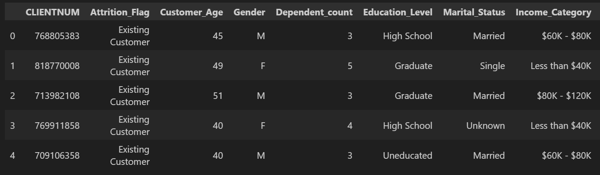
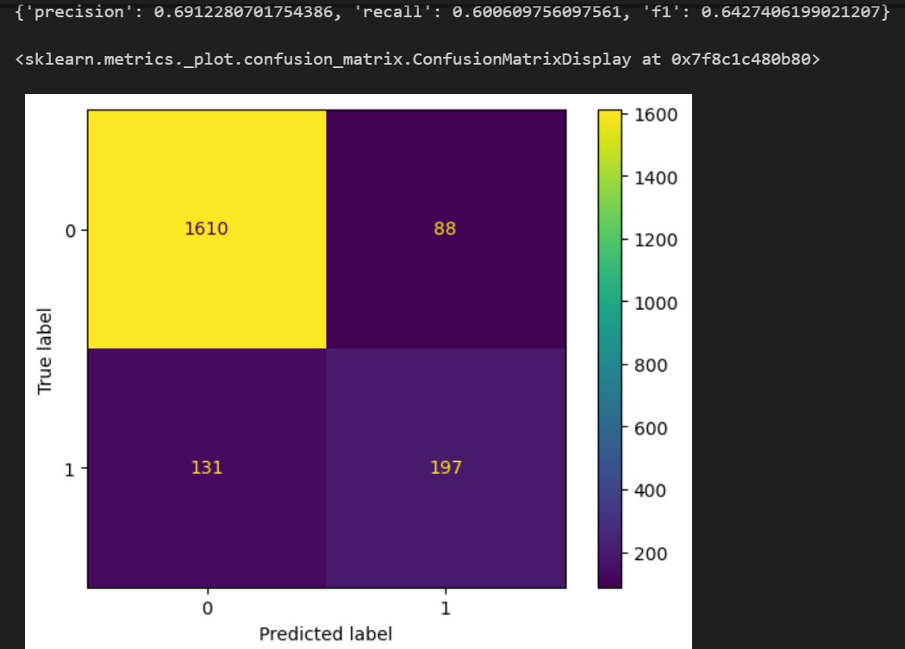

# The sample of a data science journey.

- Using data science tools to analyze new data, extract interesting information, creating basic models using intuition, sklearn and finally model evaluation.

Using the Kaggle data source on bank churners, we embark on a data science journey, from getting to know our data all the way to analyzing our model. This repository is meant as a sample of the thought process behind the work of a data scientist, including a jupyter notebook that was done with the explicit goal of documenting in real time the entire process.
 
It also includes a `Model` class that can be used for further exploration of other models or other datasets, although small customizations might be necessary to work with different datasets. Running an instance of the class with the default parameters will use (or create) a Balanced Random Forest model, which is the choice we made during the analysis (more information about the analysis can be found below).
 
 

## Installation

 
In order to run the jupyter notebooks completely, it's best to run `pip install -r global_requirements.txt`. You will also need to install `graphviz` in your computer, if using linux you can do so via `sudo apt-get install graphviz`, for other operating systems check [this](https://graphviz.org/download/) link. 
If you just want the model, you can download the file `src/model.py` directly, for the model specific requirements run `pip install -r model_requirements`

## Usage

* Going through the though process.

The `Explorations.ipynb` jupyter notebook is a real time documentation of the though process. While most critical and meaningful insights are explained in the notebook itself, a summary filled with samples from the notebook can be found below to help beginners go through it, although it's still highly recommended to see the notebook itself for a more complete picture (including errors, abandoned decisions etc).

* Model

The model we decided on the analysis can be used (or recreated or even modified) using the class `Model()` on the `model.py` file. When instantiating the class you need to provide it with a model_name for the model you will be working with and it will look for it in the `models/` folder (in the form a 'model_name.pkl' pickle file). If it does not find it, it will try to create one according to the parameters you have offered (you can create your own models to use, or other defaults from scikit-learn). You can also change the default location/name of the csv file containing the data using the class attribute `Model.default_data_location`

## Summary

### Getting to know and analyzing our data

It began as it always begins: By finding and importing the data. The data used here came from kaggle, but it's been added to this repository already. The best way get to know new data, it's to just take a look at it!
 
 

 
 
Instantly some categorical data grabs our attention, before we manipulate anything, let's take a look at how they are distributed, just to have an idea.
 
 

 
 
We can see for example, that `Card_Category` is very skewed towards `Blue`, the remaining samples in the other categories (especially `Gold` and `Platinum`) are so small that we probably don't have enough to data to make meaningful judgments using on them. It's not a great insight, but just by nature of looking at it, we start to learn what will be helpful and what will not when it's time to modelling.
 
 
But of course, the best way to look at data is to make usage of graphics. But which graphics? Here, I decided to split the dataset into customers who have churned and those who have not and looked at the distribution of all features among those 2 groups. If any feature can offer us insights about whether or not a customer is likely to churn, those distributions will have to look different. Another way to think about it is this: If none of the features have anything to say about someone churning or not, then seeing the subset of churners would be no different than seeing a random subset. And if we split the dataset randomly, plots made on both subsets would look the same! So let's see some plots here and compare them with the same graphs but for the churners.
 
 

 
 
In our dataset we have almost 20 features, but here is just a sample. Let's see the same graphs for the churners.
 
 

 
 
We can already see some differences, `Total_Transaction_Ct` for example seems to skewed to less transactions for the churners. Makes sense, people who use their cards less are more likely to move on. But looking at plots one by one is hard, we need a better way to compare, what about if we put them side by side?
 
 

 
 
That's definitely better, but the graphs are not on the same scale. Sure, we can still find differences and get insights from those, but it's not so easily visible and requires a little bit of experience. Despite all that, some of the previous insights have become clearer, `Total_Trans_Ct` clearly has a different shape for customers who churned for example. But we can still do better visualizing, let's try to improve even more.
 
 

 
 
Now we are talking, we put everything on the same scale and plotted them together as one. It's much clearer , for example, that for `Avg_Utilization_Ratio`, customers who churned tend be much closer to 0, although all customers have a proportionally low utilization ratio. Making similar plots to other variables that we believe to be impactful will help us make sure they have information to provide.
 
 

 
 
Now that we believe we know which features seem to be the most impactful, let's see how the proportion of churners change when we filter by those variables:
 
 

 
 
Interestingly, when we filter by customer who have made less than 60 transactions over the last 12 months, the proportion of those who churned jumps from ~ 16% to around ~ 34%. Impressive, whatever model we make, this feature will have to be a part of it. This feature by itself can't make a meaningful prediction but it shows that we are on the right path (if we assumed that everyone who has less than 60 transactions would churn, we would be right only about 34% of the time, but that's twice as much as guesing randomly!)

### Basic Modelling

Given the analysis we have done so far, we can create a very simple model. Simplicity is in general a desired characteristic, it helps prevent overfitting (especially for beginners) and helps with explainability (we are after all creatrures of narratives). While a better performing model is, obviously, better it's good to have something simple to compare it to so can make sure that the "complexity cost" of the new model is worth the extra predictive abilities it has.
 
 

 
 
With the base model at hand, let's see how good it is:
 
 

 
 
Not great obviously, but actually not bad. Precision is terrible, which means we target a lot of people who did not become churners, but we are also catching a lot of the people who do (~90%). Here is where modelling becomes more than mathematics: This very simple model cast a wide net and catch a lot more than we want but also gets almost everything we want. Depending on the business needs, this might be ok. If the marketing department plans to target our "possible customers to churn" with a digital campaign that's cheap to scale, this model might be enough.
 
 
But imagine they want to give $100 voucher for everyone who is likely to churn, then suddenly casting a wide net like our model does is quite bad, it would cost the bank way more just because our model does not have good precision!
 
 
In a way our model informs what the client can do and client informs us what kind of model we should strive for. But this is just our base model, we will try to improve it anyway, but for the sake of this exercise, we are gonna assume that recall is more important (aka, casting a wide net is ok, just not such a big net as this basic simple model).
 
 

 
 
Here we can compare our base model with a random forest based on exactly the same features, the same ones our preliminary analysis suggested were the most important. It's overall better, but it lost a lot of the recall. Interesting. Let's run the same model but with all available features...
 
 

 
 
Precision is much higher, but recall is similar. That's probably in part because ourdataset is imbalanced. Customers who churned represent only around 16% of the total, making it so our model has an easy way to increase the performance metrics just by guessing (a more complex variation of) that no one will churn. They will get it right ~ 84% of the time already! Some models don't deal well with imbalanced data and there are several way to handle it. One is using the `BalancedRandomForestClassifier` from the `imblearn` library. Without going into too many details, it basically train the trees into balanced subsets of the data, so that the trees don't have an "easy way out" by just overguessing one option.
 
 

 
 
That's much better, more balanced result and a higher recall like we want. We can even visualize some our trees in our random forest to get a better understanding of what our model is doing.
 
 

 
 

 
 
We can see that the biggest and more meaningful splits still are the ones we expected to be relevant from our analysis. Let's see if we can reduce complexity but focusing on those features without sacrificing much precision and recall.
 
 

 
 
We have only 6 features left and the performance is still pretty much were it were. We lost some precision, but we are still capturing the vast majority of our target audience and the improvement is significant over the base model, so the added complexity is worth it. But this is not the entire story, there are better ways to understand and know our model. A common approach is to draw the Lift and Gain curves. Once again, more detail (including how to implement them) is available in the notebook, but they basically tells us how much better our model is than the average and how much of our target audience we can reach by reaching just a share of the customers we flagged.
 
 

 
 
The Lift curve shows that for the top 10% customers most likely to leave (according to our model) leave at a rate 5 times higher than the naive random model! That's very impressive, Let's look at the Gain curve.
 
 

 
 
Here we can see that the 20% customers our model consider more at risk of churning, represent more than 90% of the customers our model will inevitably find, meaning that we can reduce the size of our "wide net" and not sacrifice many of our hits.
 
 
This is just a summary of all the information and thought process that went into this project. I recommend checking the jupyter notebook for further insights and other details.

## Context

This project was made by Henrique Rauen during 2 weeks as part of the becode AI operator training.
